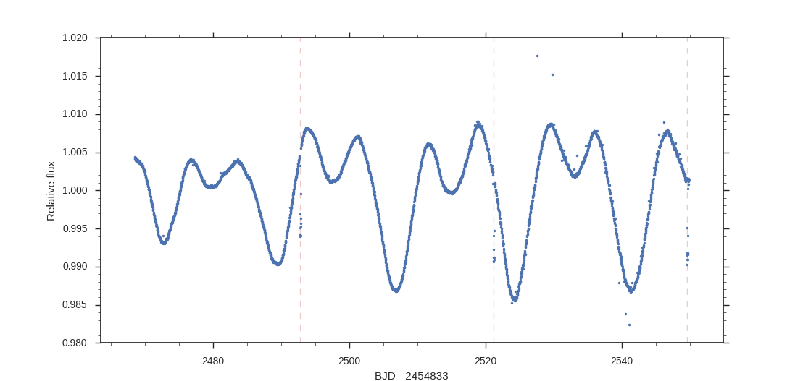
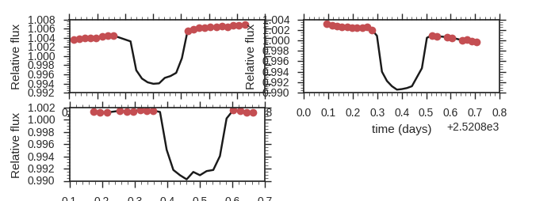
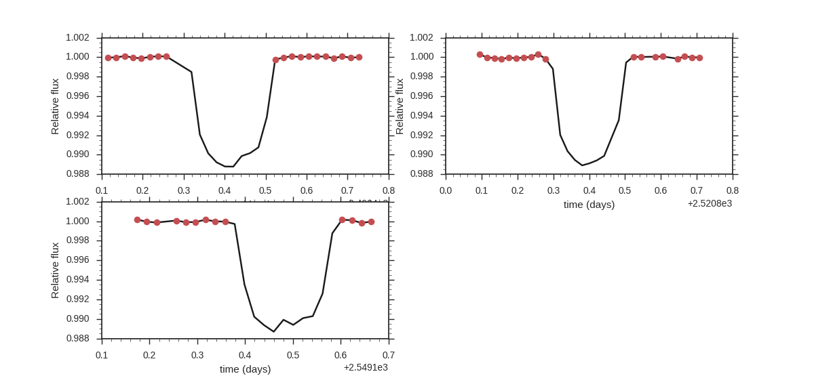
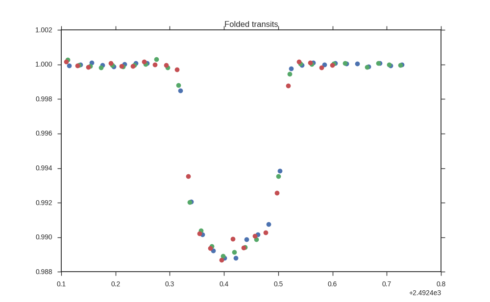
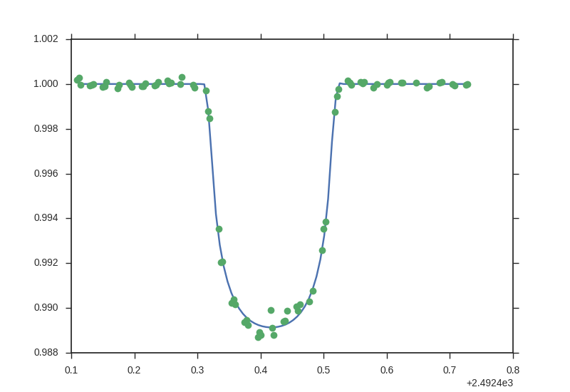
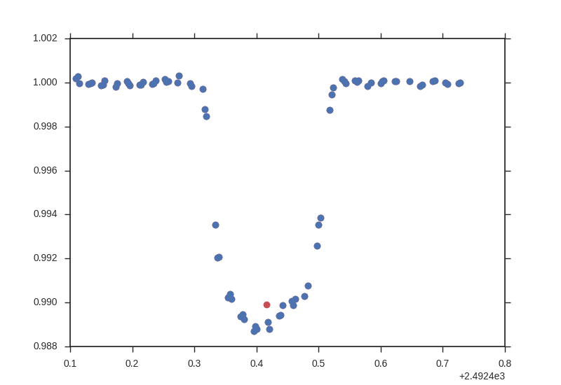

# EXOTRENDING
#### Written by Barragán O. & Gandolfi D.
##### email: oscaribv@gmail.com
##### Updated Jun 05, 2017

<a href="http://ascl.net/1706.001"></a>

## Introduction

* This software is a small code to detrend exoplanet transit light curves.

* It is very simple and straightforward.

* If you have a light curve (flux versus time) and some good ephemeris (epoch of first
transit and orbital period), this code can help you!

* The code has been tested with Kepler and K2 light curves, but it should work
 with any other light curve.


## Dependencies

You need to install:
* gfortran
* numpy
* matplotlib
* scipy
* seaborn (optional)

## Use it now!

You do not need to install anything, just clone or download the repository.

```
git clone https://github.com/oscaribv/exotrending
```

The advantage about cloning the repository is the possibility to follow the changes of this package easily with git pull (learn more about git
in [https://git-scm.com/](https://git-scm.com/)).
Alternatively, you can use


```
wget https://github.com/oscaribv/exotrending/archive/master.zip
unzip master.zip
mv exotrending-master exotrending
```

If you choose this option, you should repeat it every time the code is updated.

Next, you have to compile the file with the transit routines (it has to be done
 only one time!)

```
cd exotrending/src
make
```
If no error occurs, then you are ready to run the test case!

First, return to the parent directory
```
cd ..
```
The test case comes from [Barragán et al. (2017)](https://arxiv.org/abs/1702.00691).
There are 3 transits of the planet visible in the K2 data. The file with the light curve is called
"warm_jupiter.dat". The ephemeris are
P = 28.38229 days and T0 = 2492.81705 (BJD - 2454833.0) days.
The transit duration is about 5 hours. Ten hours of data centered around
each transit are used to detrend the data.

The informations are provided in the input.py file.

```Python
#Input file

#the name of the file with the light curve data
lc_file='warm_jupiter.dat'

#Flag to indicate if we want a plot with the seaborn library
#Uncoment next line to have similar plots to the ones in this tutorial
#is_seaborn = True

#Ephemeris
#Period
P = 28.38229
#Epoch of first transit
T0 = 2492.81705
#Transit duration in days
ttran = 5.0/24.0
#out of transit duration in days
toutt = 10./24.0
```

We are ready to run the program

```
python exotrending.py
```
You will see

` This is the whole light curve `



These are the whole time series data with the position of each
 transit marked with a vertical dashed line.

` Individual transits `



`I found 3 transits`

These are the transits found by the code (3 in this case). The next plot is

```
Individual detected transits
FITTING POLINOMIAL ORDER =  2
METHOD = SUBSTRACTION
detrended transits
```



These are the DETRENDEND transits. The next plot shows the
phase-folded data.

` folded transits `



The code will now fit a Mandel & Agol (2002) model to the transit light curve

```
STARTING SIGMA-CLIPPING
with =  3.0 -sigma
I AM FITTING THE DATA
```



and then perform the sigma clipping

```
SIGMA-CLIPPING ENDED
BLUE POINTS -> good data
RED POINTS  -> rejected data
```



```
CREATING OUTPUT FILE =  warm_jupiter_detrended.dat
```

The red points are the rejected data.

 The output files of the code are
* light_curve.pdf, light curve plot.
* warm_jupiter_detrended.dat, detrended transit light curves. First column is time,
second flux and third error bars.

## Documentation

The previous example is a simple case.
You can detrend any other light curve by changing the parameters of the input.py
file. There are more option in the code
that can be modified in the input.py file. Although there is no manual yet,
 a description of the variables is provided inside the `src/default.py` file.


## Software in development

This software is under contruction and debugging.

**If you have any doubts or suggestions, please do not hesitate to contact me.
email: oscaribv@gmail.com**

## Acknowledgements
* Many thanks go to Lauren Flor Torres, Sebastian Morales, Fernando Romero and Mabel Valerdi
for their precious help.
